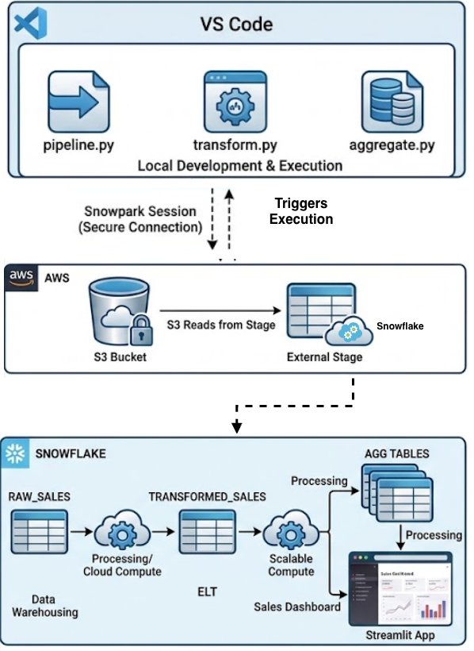
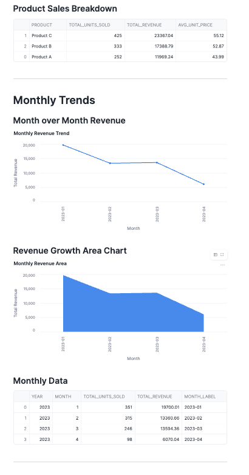
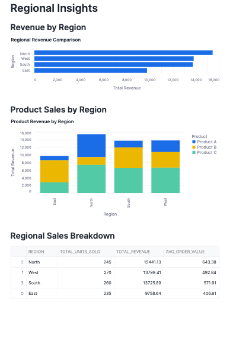

# 📊 Retail Sales Performance Pipeline

> **An end-to-end data engineering project** analyzing retail sales data through a production-pattern ELT pipeline — from AWS S3 ingestion through Snowpark Python transformations to an interactive Streamlit dashboard hosted in Snowflake.

[](https://python.org)
[](https://snowflake.com)
[](https://aws.amazon.com)
[](https://github.com/tbhatti211-wq/retail-sales-performance)

---

## 🧭 Project Overview

Retail organizations need clear visibility into product performance, regional trends, and seasonal buying patterns to make informed decisions on inventory and promotions. This project builds a function-oriented Python pipeline that ingests raw sales data from AWS S3, applies ELT transformations using Snowpark, computes business metrics across three aggregation layers, and visualizes insights through a native Streamlit dashboard inside Snowflake — with no BI tools required.

**Key questions this project answers:**

- Which products generate the highest revenue and do high unit volumes always translate to high revenue?
- Which regions are outperforming and which are underserving their market?
- Are there seasonal sales patterns that can inform promotional timing?
- What is the average order value by product and region?

---

## 🗂️ Project Structure

```
retail-sales-performance/
│
├── database_files/
│   ├── connection-demo.json    # credential-free template showing required connection fields
│   ├── connection.json         # your actual Snowflake credentials — gitignored, never commit
│   ├── snowflake_session.py    # SnowflakeSession class — single session entry point for all scripts
│   └── snowflake_setup.sql     # one-time Snowflake setup: database, schema, integration, stage
│
├── scripts/
│   ├── aggregate_data.py       # stage 3: builds 4 aggregation metric tables from TRANSFORMED_SALES
│   ├── create_table.py         # DDL for all 6 Snowflake tables — run once before pipeline
│   ├── pipeline.py             # stage 1: loads raw sales data from S3 stage into RAW_SALES
│   └── transform_data.py       # stage 2: extracts month/year, renames columns, writes TRANSFORMED_SALES
│
├── screenshots/
│   ├── performance_dashboard_1.png    # product performance section
│   ├── performance_dashboard_2.png    # monthly trends section
│   └── performance_dashboard_3.png    # regional insights section
|
├── streamlit/
│   ├── streamlit.py
│   └── livemov.mov                    # live dashboard recording
│
├── .gitignore                  # excludes connection.json, __pycache__, .env, .DS_Store
├── architecture.png            # three swim lane architecture diagram: local, AWS, Snowflake
├── README.md                   # full project documentation including setup, WHY decisions, and findings
└── requirements.txt            # Python dependencies: snowflake-snowpark-python, pandas
```
---

## 🛠️ Tech Stack

| Layer | Technology | Why |
|---|---|---|
| Source storage | AWS S3 | Durable, low-cost object storage — standard landing zone for flat files in cloud pipelines |
| Auth bridge | Snowflake Storage Integration + AWS IAM | Secure credential-free connection between Snowflake and S3 — no AWS keys hardcoded anywhere |
| Stage | Snowflake External Stage | Named pointer from Snowflake into S3 — decouples file location from load logic |
| Compute | Snowflake + Snowpark Python | All transformations execute inside Snowflake's engine — Python is the driver, not the processor |
| Pipeline | Python (function-oriented) | Modular, testable, reusable functions with full error handling across load, transform, and aggregate phases |
| Visualization | Streamlit in Snowflake | Native dashboard hosted inside Snowflake — no external BI tool, no deployment, reads directly from agg tables |
| Charts | Altair | Natively supported in Streamlit in Snowflake — declarative grammar, clean syntax for bar, pie, line, and area charts |

---

## 🏗️ Architecture



```
Local (VS Code)
    pipeline.py → transform.py → aggregate.py
          |
          | Snowpark session (secure connection, triggers execution in Snowflake)
          |
AWS
    S3 Bucket (sales.csv)
          |
          | Storage Integration
          |
    External Stage (retail_sales_stage)
          |
          | COPY INTO
          |
Snowflake (RETAIL_SALES_PERFORMANCE.PERFORMANCES)
    RAW_SALES
          |
    TRANSFORMED_SALES (+ MONTH, YEAR, TOTAL_SALES)
          |
    AGG_PRODUCT_SALES
    AGG_REGIONAL_SALES
    AGG_MONTHLY_SALES
    AGG_REGION_PRODUCT_SALES
          |
    Streamlit Dashboard (product / monthly / regional sections)
```

---

## 📦 Pipeline Stages

### Stage 1 — Raw Load (pipeline.py)

- Reads `sales.csv` from Snowflake External Stage pointing to S3
- Executes `COPY INTO RAW_SALES` with full file format configuration
- Loads 100 rows across 6 columns: `date`, `product`, `region`, `units_sold`, `unit_price`, `sales`
- Verifies row count and previews sample data using Snowpark DataFrame API

### Stage 2 — Transform (transform.py)

- Reads from `RAW_SALES` into a Snowpark DataFrame — lazy evaluation, no data movement yet
- Extracts `MONTH` and `YEAR` from `DATE` using Snowpark built-in functions
- Renames `SALES` to `TOTAL_SALES` for semantic clarity
- Writes final column-ordered DataFrame to `TRANSFORMED_SALES` using `overwrite` mode
- All transformations execute inside Snowflake's engine — Python defines the plan, Snowflake runs it

### Stage 3 — Aggregate (aggregate.py)

Four separate aggregation functions, each with a single responsibility:

| Function | Output Table | Groups By | Metrics |
|---|---|---|---|
| `aggregate_product_sales()` | `AGG_PRODUCT_SALES` | Product | Total units, total revenue, avg unit price |
| `aggregate_regional_sales()` | `AGG_REGIONAL_SALES` | Region | Total units, total revenue, avg order value |
| `aggregate_monthly_sales()` | `AGG_MONTHLY_SALES` | Year, Month | Total units, total revenue |
| `aggregate_region_product_sales()` | `AGG_REGION_PRODUCT_SALES` | Region, Product | Total units, total revenue |

---

## 📊 Dashboard (Streamlit in Snowflake)

Three sections, all reading from pre-aggregated tables — no raw queries in the dashboard layer.

### Section 1 — Product Performance
- Bar chart: total revenue by product
- Pie chart: revenue share per product (Altair `mark_arc`)
- Grouped bar chart: units sold vs revenue side by side
- Data table: full product breakdown

### Section 2 — Monthly Trends
- Line chart: month-over-month revenue with data point markers
- Area chart: revenue growth trend with fill
- Data table: monthly breakdown with year-month label

### Section 3 — Regional Insights
- Horizontal bar chart: region vs total revenue sorted descending
- Stacked bar chart: product revenue breakdown within each region
- Data table: full regional breakdown with AOV

---
## 🎥 Demo

[Watch the full project walkthrough](./streamlit/livemov.mov)

---

### Dashboard Screenshots

**Product Performance**


**Monthly Trends**


**Regional Insights**


## 📈 Key Findings

| Metric | Value |
|---|---|
| Top product by revenue | Product C ($23,367) |
| Lowest product by revenue | Product A ($11,969) |
| Top region by revenue | North ($15,441) |
| Weakest region | East ($9,758) |
| Strongest month | January 2023 ($19,700) |
| Total rows in pipeline | 100 |

> Product C outsells Product A by nearly 2x in revenue despite not having 2x the unit volume — a pricing and margin story worth investigating further.

---

## 🔑 Key Design Decisions

**Why separate Python files instead of one script?**
Each file has a single responsibility — load, transform, aggregate. If the transform logic breaks, you don't re-run the load. If you need to re-aggregate with different logic, you don't touch the raw layer. Clean separation enables reprocessing without data loss.

**Why a `SnowflakeSession` class instead of inline connection code?**
Session creation is defined once and imported everywhere. If credentials change or the connection logic needs updating, there is one place to change it. Eliminates duplication across every script.

**Why Snowpark Python instead of raw SQL scripts?**
The project requirement called for a function-oriented Python program with error handling, transformations, and visualization all in one system. Snowpark lets Python define the logic while Snowflake executes it — best of both worlds. Pure SQL scripts can't handle exceptions or orchestrate multi-step pipelines cleanly.

**Why pre-aggregate into separate tables instead of querying TRANSFORMED_SALES in Streamlit?**
Streamlit should be a presentation layer only. Pushing aggregation logic into the dashboard creates tight coupling between visualization and business logic. Pre-aggregated tables are also faster to query (3-4 rows vs 100 rows) and can be independently refreshed without touching the dashboard.

**Why Altair instead of Plotly or Matplotlib for charts?**
Plotly and Matplotlib are not available in Streamlit in Snowflake's runtime environment. Altair is natively supported and uses a declarative grammar that maps directly to the data columns — clean, readable, and maintainable.

**Why External Stage instead of Internal Stage?**
The data originates in AWS S3 (outside Snowflake). An External Stage with a Storage Integration provides a secure, credential-free bridge using IAM role assumption — Snowflake never holds AWS keys directly.

---

## 🐛 Issues Caught During Build

**Issue 1 — Column count mismatch on load**
Initial `RAW_SALES` table was designed with 9 columns based on the project spec, but the actual `sales.csv` only contained 6 columns. The `COPY INTO` silently loaded 0 rows with a column mismatch error in the load history.

**Diagnosis:** Queried `INFORMATION_SCHEMA.COPY_HISTORY` to see the exact error message — "Number of columns in file (6) does not match that of the corresponding table (9)."

**Fix:** Rebuilt `RAW_SALES` with only the 6 columns present in the file. `total_sales` and `sales_rep` were listed as optional in the spec and absent from the data — `total_sales` is now derived in the transform layer as a rename of `SALES`.

**Issue 2 — Schema drop wiped all tables**
Mid-project, the `PERFORMANCES` schema was accidentally dropped, taking all 6 tables with it. The pipeline appeared to be working (Streamlit was still rendering) because the app session cached the previous query results.

**Diagnosis:** Ran `SHOW SCHEMAS IN DATABASE RETAIL_SALES_PERFORMANCE` and confirmed only `PUBLIC` remained. Queried Snowflake's account usage to confirm the schema was dropped earlier that day.

**Fix:** Recreated the schema, ran `create_tables.py`, and re-executed the full pipeline in order. Full recovery in under 10 minutes.

---

## 🚀 What I'd Improve in Production

- **Incremental loading** — current pipeline uses `FORCE = TRUE` on every run, reloading all 100 rows. In production, use Snowpipe or a watermark-based load to process only new files
- **Data quality checks** — add null checks and type validation before writing to `TRANSFORMED_SALES`
- **Parameterized stage path** — stage name and S3 path should be environment variables, not hardcoded defaults
- **Orchestration** — wrap the three pipeline scripts in an orchestrator (Airflow, Prefect, or Snowflake Tasks) for scheduled, dependency-aware execution
- **Resource monitor alerts** — email notifications at 75% credit usage rather than relying on auto-suspend alone
- **Streamlit filters** — add date range and region filter widgets so stakeholders can slice the dashboard interactively

---

## 🏃 Getting Started

### Prerequisites

- AWS account with an S3 bucket containing `sales.csv`
- Snowflake account (free trial sufficient)
- Python 3.10+
- VS Code or any local IDE

### Setup Order

```
1. AWS IAM         → create role, attach S3 read policy
2. Snowflake       → run CREATE STORAGE INTEGRATION SQL
3. Snowflake       → run DESC INTEGRATION, copy ARN + External ID
4. AWS IAM         → paste ARN + External ID into trust policy
5. Snowflake       → run CREATE STAGE SQL
6. Snowflake       → run LIST @retail_sales_stage to verify file visible
7. Local           → pip install -r requirements.txt
8. Local           → fill in connection.json with your credentials
9. Local           → python create_tables.py
10. Local          → python pipeline.py
11. Local          → python transform.py
12. Local          → python aggregate.py
13. Snowflake UI   → create Streamlit app, paste dashboard code
```

### Verify Pipeline

```sql
-- confirm raw load
SELECT COUNT(*) FROM RAW_SALES;

-- confirm transform
SELECT * FROM TRANSFORMED_SALES LIMIT 5;

-- confirm aggregations
SELECT * FROM AGG_PRODUCT_SALES ORDER BY TOTAL_REVENUE DESC;
SELECT * FROM AGG_REGIONAL_SALES ORDER BY TOTAL_REVENUE DESC;
SELECT * FROM AGG_MONTHLY_SALES ORDER BY YEAR, MONTH;
```

### connection.json Structure

```json
{
    "account": "your_account_identifier",
    "user": "your_username",
    "password": "your_password",
    "role": "ACCOUNTADMIN",
    "warehouse": "COMPUTE_WH",
    "database": "retail_sales_performance",
    "schema": "performances"
}
```

> `connection.json` is gitignored. Never commit credentials.

---

## 🧑‍💻 About This Project

This project was built as part of the Data Engineering Academy curriculum to demonstrate end-to-end pipeline construction with production-pattern design:

- **ELT over ETL** — raw data lands in Snowflake first, transformations happen inside the warehouse engine using Snowflake's compute
- **Separation of concerns** — load, transform, aggregate, and visualize are four distinct layers with no coupling between them
- **Snowpark-native** — all transformation logic uses the Snowpark DataFrame API, keeping computation inside Snowflake rather than pulling data into Python memory
- **Cost-aware design** — auto-suspend set to 60 seconds, resource monitor capped at trial credits, pre-aggregated tables minimize dashboard query cost

**Author:** Talib Hussain
**GitHub:** [github.com/tbhatti211-wq](https://github.com/tbhatti211-wq)
**LinkedIn:** [linkedin.com/in/talhussain](https://linkedin.com/in/talhussain)

---

## 📄 License

MIT License — analysis code free to use and adapt.

---

*Last updated: July 2026*
